!!! info Goals
- [x] Extend the current phase curve modeling to include the spin effect of asteroids.
- [x] Extract spin information based on ZTF data
- [ ] Make this information available from the Fink REST API
!!!

The observed magnitude of asteroids is the sum of various contributions. Some are purely geometrical (e.g. the position of the asteroid within the Solar System during the observations), some are reflecting intrinsic properties of the asteroids (chemical composition, spin, ...).

!!! danger Todo/Questions
- [x] Use a software to compute ephemerides instead of the Miriade API (too many timeouts)
- [ ] Understand better the bimodal distributions for $\alpha_0$
- [ ] Redo the analysis with a per-band granularity
- [ ] Use H_g - H_r to predict a C/S taxonomy (a la Sergeyev2022)
!!!

## Phase curve

The typical modeling of the phase curve can be written as:

$$
\begin{equation}
H = m_{obs} + f(distance) + g(\alpha, G)
\end{equation}
$$

where $H$ is the absolute magnitude, $m_{obs}$ is the observed magnitude (typically provided by the observer), $f(distance) = -2.5 \log(D_{helio}^2 D_{obs}^2)$ is a function that depends on the distance of the object to the observer and the Sun, and $g(\alpha, G)$ is a function of the phase angle $\alpha$ and G is the phase slope.

## HG1G2 extension

There have been some efforts to extend the previous definition (e.g. Mahlke et al 2021):

$$
\begin{equation}
H = m_{obs} + f(distance) + h(\alpha, G_1, G_2)
\end{equation}
$$

where this time the phase slope has two components, $G_1$ and $G_2$, with the condition $G_1 + G2 < 1$.

## Spin extension

Going one step beyond, one can model the effect of the spin on the lightcurve by adding another contribution:

$$
\begin{equation}
H = m_{obs} + f(distance) + h(\alpha, G_1, G_2) + s(R, \alpha_0, \delta_0)
\end{equation}
$$

where 

$$
\begin{align}
s(R, \alpha_0, \delta_0) = -2.5 \log \Big[ 1 - (1 - R) ( \sin{\delta} \sin{\delta_0}\\ + \cos{\delta}\cos{\delta_0}\cos{(\alpha - \alpha)} ) \Big] 
\end{align}
$$

with $R$, the oblateness of the object, defined as the ratio between the diameter at the pole and the diameter at the equator: $R = D_p / D_e$, $(\alpha, \delta)$ are the RA and Dec of the object, and $(\alpha_0, \delta_0)$ are the ecliptical longitude and latitude of the pole, respectively.

### Circular case

One can see that in the case of $R=1$ (circular object), the Eq. 3 reduces back the HG1G2 case (Eq. 2).

### Wavelength dependencies

Conversely to $(H, G_1, G_2)$, the spin parameters $(R,\alpha_0, \delta_0)$ do not depend on the wavelength of the observation.

## Implementation

We first tried to extend the current $HG1G2$ class of $\texttt{sbpy.photometry}$, with no success (the problem was that the solver would only accept the phase angle as input, and the proper inclusion of $(\alpha, \delta)$ would require a lot of work). So instead we wrote a home-made solver based on $\texttt{scipy.optimize.curve\_fit}$. We use a Trust Region Reflective algorithm to perform the minimisation. Note this is a non-linear least squares. 

!!! danger Basic method (la methode pour les nuls)

We would assume here no wavelength dependency for the $(H, G_1, G_2)$ parameters, and use all data available to fit for 

$$
\begin{equation}
( H, G_1, G_2, R, \alpha_0, \delta_0)
\end{equation}
$$

but in principle we should rather estimate:

$$
\begin{equation}
( H^g, G_1^g, G_2^g, H^r, G_1^r, G_2^r, R, \alpha_0, \delta_0)
\end{equation}
$$
!!!

## Data

We use alert data from ZTF between 2019/11 and 2023/01. Measurements are taken in 2 filter bands (g and r). We work on asteroids with more than 50 measurements, and apply a series of quality criteria:

| Condition | Number  | Fraction of total |
|:-----------|---------:|-------------------:|
| N>50      | 104,242 | 100%              |
| With counterpart in BFT     | 104,005 | >99% |
| Fit converged | 103,165 | 99%              |
| Physical phase |    87,399  | 84% |
| Bronze       | 66,066 | 63%              |
| Silver       | 19,708 | 19%              |
| Gold       | 1,625 | 2%              |

By physical phase, we mean a physical solution for the phase slope: $G_1 + G_2 <= 1$. Note that we split the objects with a physical phase (87,399) into 3 samples with various quality: gold, silver, and bronze. Each implements different cuts:

|  | $\chi^2_{red}$ | $\alpha_0/\sigma(\alpha_0)$ | $\| \delta_0 \| /\sigma(\delta_0)$ | $R/\sigma(R)$
|-|-|-|-|-|
|Bronze|$-$|$-$|$-$|$-$|
|Silver|$< 20$|$\geq 1$ |$\geq 1$|$\geq 1$|
|Gold|$0.5 < \chi^2_{red} < 1.5$| $\geq 3$|$\geq 3$|$\geq 3$|

By construction, there is no overlap between the three samples.


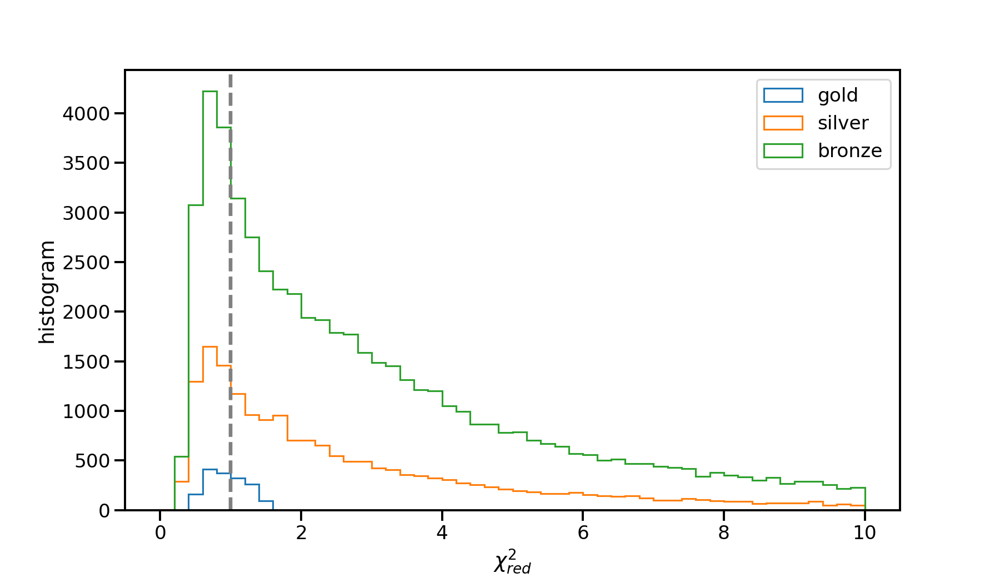
_Distribution of $\chi^2_{red} = \chi^2 / dof$ for the different samples described below._

### Basic statistics


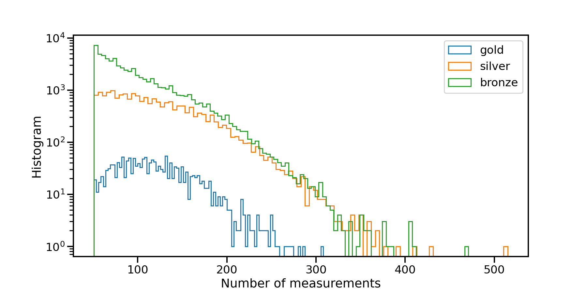
_Number of objects as a function of the number of measurements (both g&r), for different quality cuts. While the mean number of measurements increase with quality, more measurements do not necessarily mean better quality._


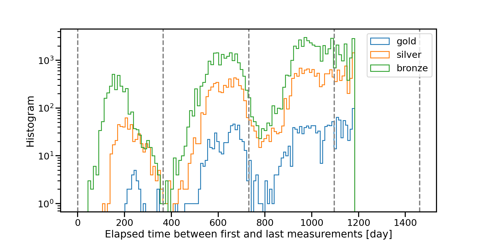
_Number of objects as a function of the elapsed time between the first and the last measurements (in days). While objects in the gold sample have been observed with larger time lapse, longer time lapses do not mean better quality._

!!! note What drives the quality of the fit?
It is interesting to note that neither more measurements nor longer observations are fully responsible for the quality of the fit. Maybe we should try to compute the number of oppositions instead?
!!!

### Object types


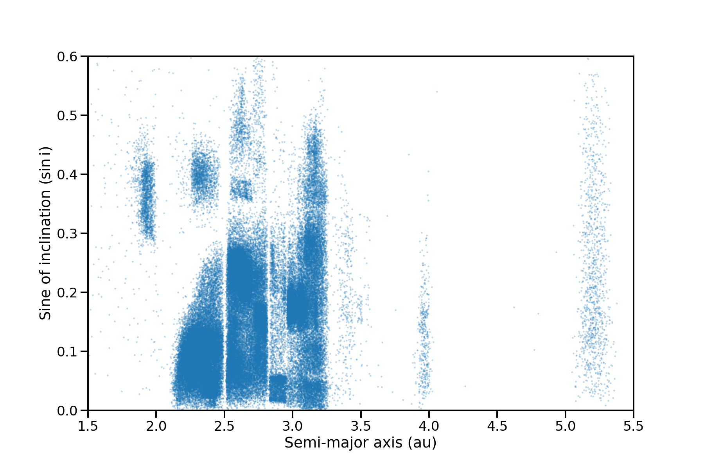
_Sine of the inclination as a function of the semi-major radius for the 87,399 SSO objects with a physical solution._

## Results

### H, G1, G2


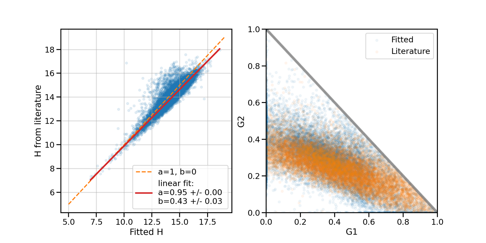
_[Left] Correlation between the absolute magnitude taken from the BFT (Johnson V), and the fitted absolute magnitude, for the silver sample (189,708 objects). While the correlation is not perfect, the differences are not catastrophic. There is a systematic overstimation of the fitted H (red line). [Right] Fitted and literature-based G2 as a function of G1, for the silver sample._

### Spin parameters

Let's use the basic method, where we use all data available for each object, and let's look at the estimated parameters. 

#### Ecliptical longitude of the pole $\alpha_0$


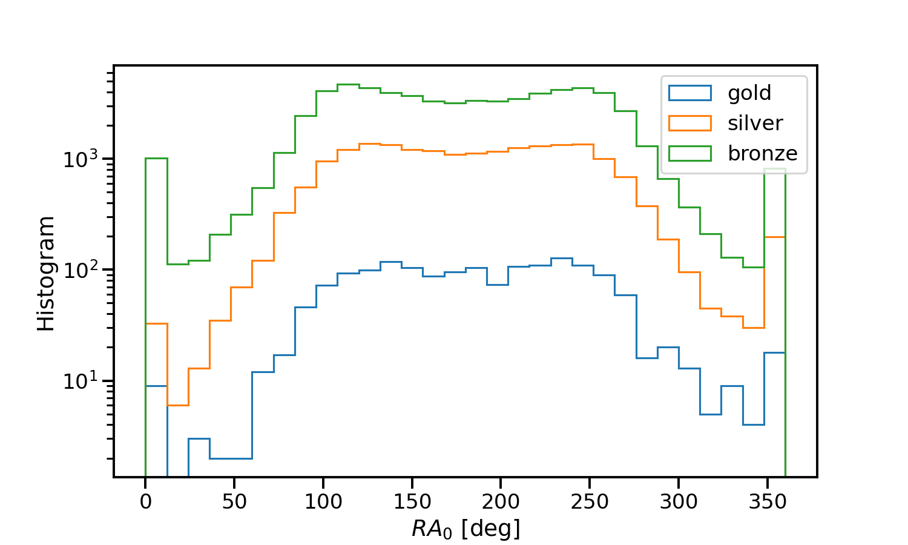
_Distribution for the ecliptical longitude of the pole $\lambda_0$, for the various samples. There is seems to be two peaks at $\lambda_0 \sim 120$ and $\lambda_0 \sim 260$. Going from bronze to gold, the doubly peaked distribution is less obvious._

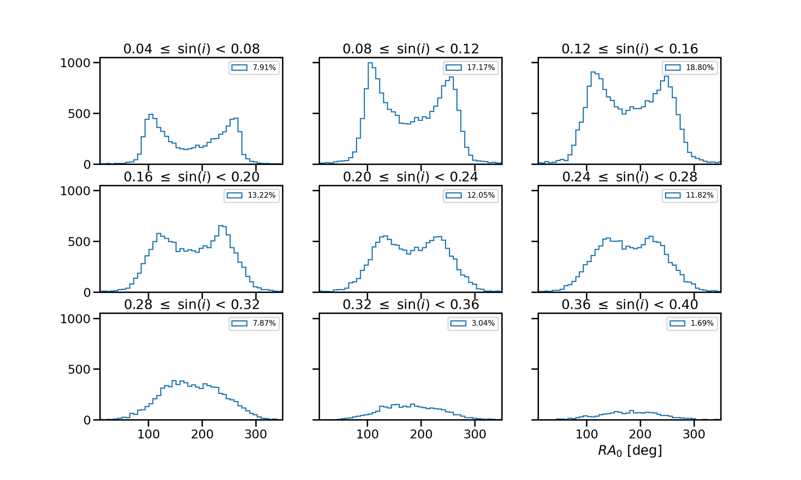
_Distribution of ecliptical longitudes for asteroids in all the object with a physical solution, for different inclinations $\sin(i)$ of their orbits. We observe a bimodal distribution for low inclination values that slowly becomes unimodal at higher inclination values. It seems to me that there is a transfer of the spin from small inclinations to high inclinations. Numbers in parenthesis displays the fraction of the data set for each bin in inclination._

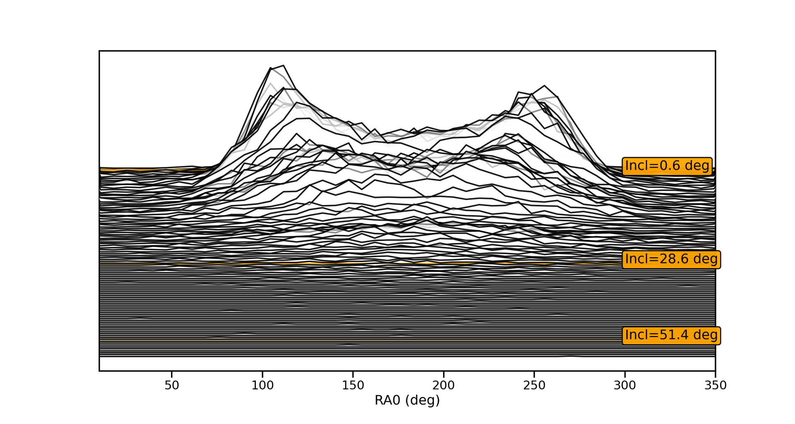
_Waterfall view of the distribution of ecliptical longitudes for asteroids in all the data as a function of inclinations $\sin(i)$ of their orbits. Just because it is fun._


#### Ecliptical latitude of the pole $\delta_0$


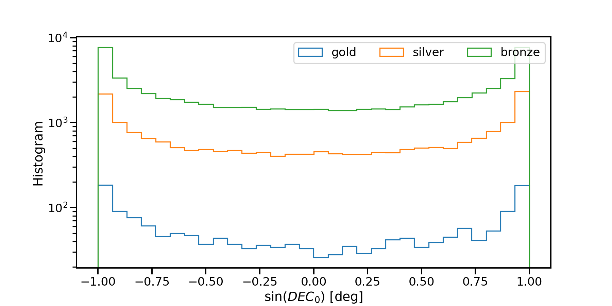
_Distribution of the sine of ecliptical latitudes $\delta_0$, between $-90^\circ$ and $90^\circ$, for the objects in the different samples. Similarly to Cibulková et al 2016 (see e.g. Fig. 2), we find a nonuniform distribution, with preference for large values. However, authors point out that determination of $\delta_0$ is subject to systematic bias that needs to be corrected before interpreting the results. TBD._

#### Spin distance

Among the 87,399 objects with spins (gold + silver + bronze), we found 2,752 objects whose spin values were available. We computed the distance between the fitted solution and the literature using angular separation. In case an object has several reported spin values in the literature, we take the closest one. In addition, we define the significance as:

$$
\sigma = \dfrac{\text{distance}[(\alpha_0, \delta_0), (\alpha, \delta)]}{\sqrt{\alpha_0^2 + \delta_0^2}}
$$


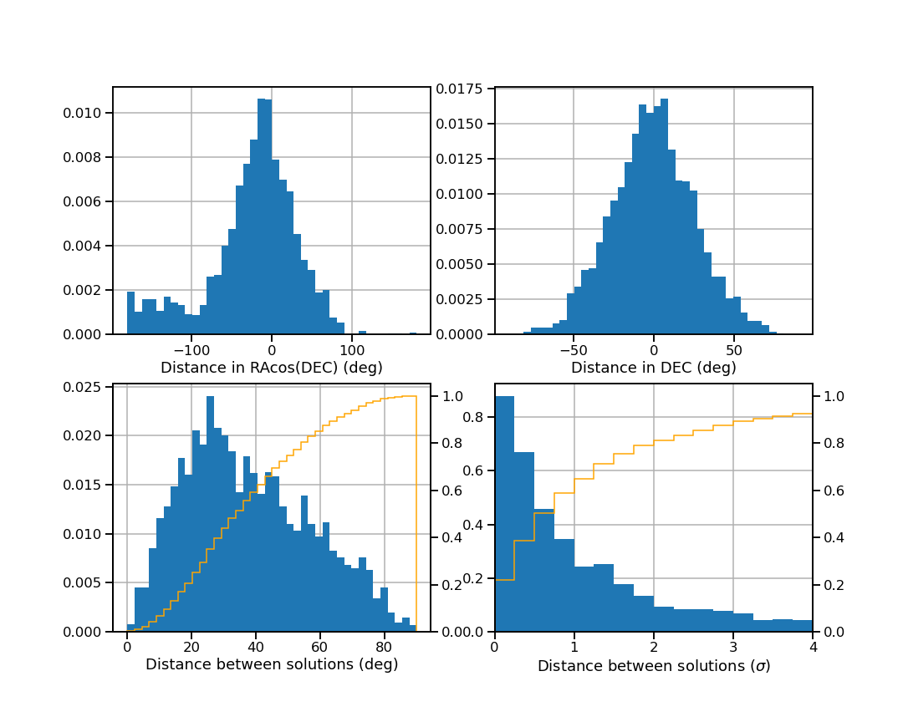
_Validation of fitted spin values against values reported in the literature for these objects.  [Top] Geometrical distances between fitted and literature spin components $\alpha_0$ and $\delta_0$. [Bottom left] Distance (on the sphere) between fitted and reported spins. [Bottom right] Distance between fitted and reported spins in terms of significance._


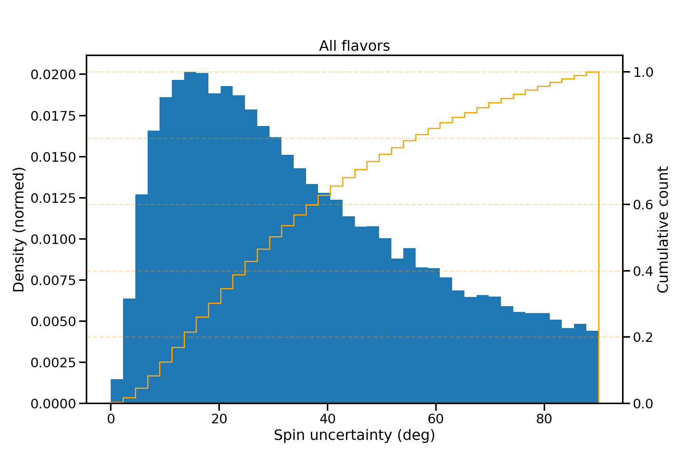
_50% of objects have a spin uncertainty ($\sqrt{\alpha_0^2 + \delta_0^2}$) below 30 degrees._

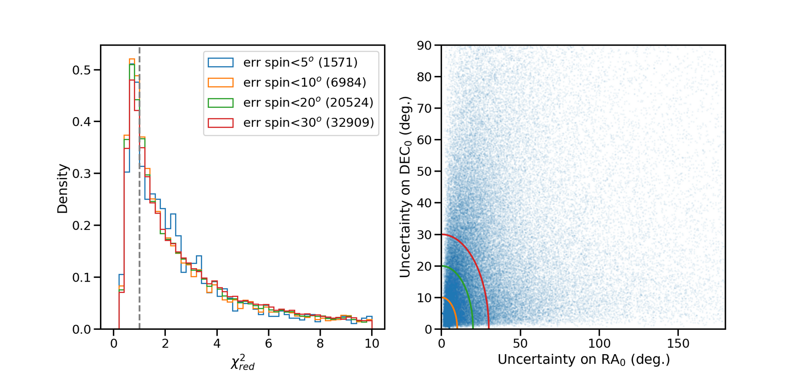


#### Oblateness

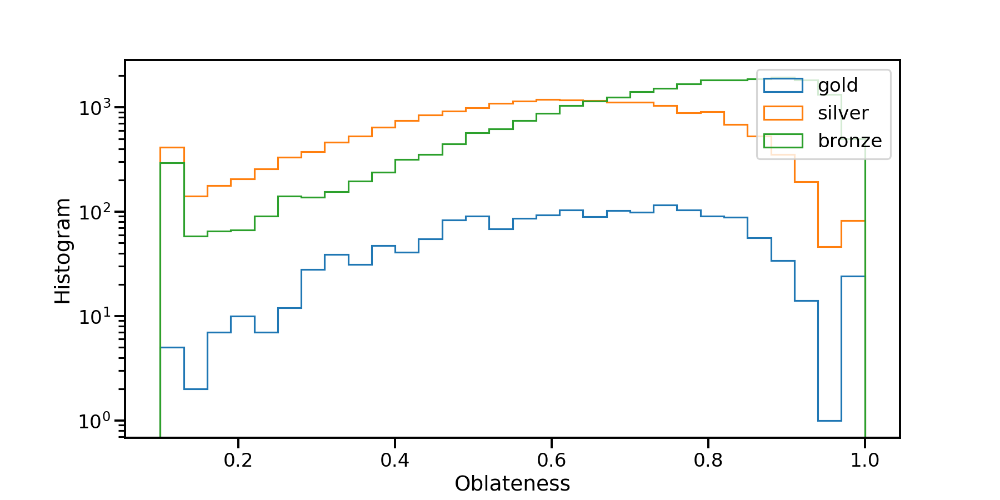

### Model improvement


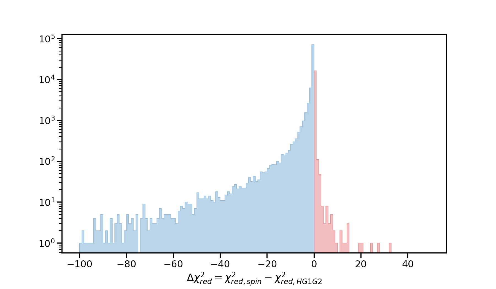
_Distribution of the differences in chi2 between the HG1G2 + spin model and the HG1G2 model for all objects with physical phase parameters. In blue, the spin model brings improvements. In red, the spin model degrades predictions._


## Troubleshooting

### Ephemerides

I found subtle differences in the ephemerides between local and web mode:

```python
In [5]: pdf1.head(1)                                                                                                                                          
Out[5]: 
   index          Date         LAST         HA         Az  ...               v:lastdate              v:firstdate  v:lapse  v:constellation  i:magpsf_red
0      0  2.459978e+06  14:05:00.35  22.034579  143.81668  ...  2023-02-02 13:02:19.997  2023-02-02 13:02:19.997      0.0         Scorpius     12.358756

[1 rows x 98 columns]

In [6]: pdf2.head(1)                                                                                                                                          
Out[6]: 
   index          Date         LAST         HA          Az  ...               v:lastdate              v:firstdate  v:lapse  v:constellation  i:magpsf_red
0      0  2.459978e+06  14:05:00.38  22.034588  143.816824  ...  2023-02-02 13:02:19.997  2023-02-02 13:02:19.997      0.0         Scorpius     12.358756

[1 rows x 98 columns]
```

Missing patch?

### Performances

```bash
# local ephemcc
5.3 s ± 148 ms per loop (mean ± std. dev. of 7 runs, 1 loop each)

# REST API
3.34 s ± 464 ms per loop (mean ± std. dev. of 7 runs, 1 loop each)
```

I am 60% slower with the local installation of eproc :-( 

Cache issue (I am not reusing information)?
